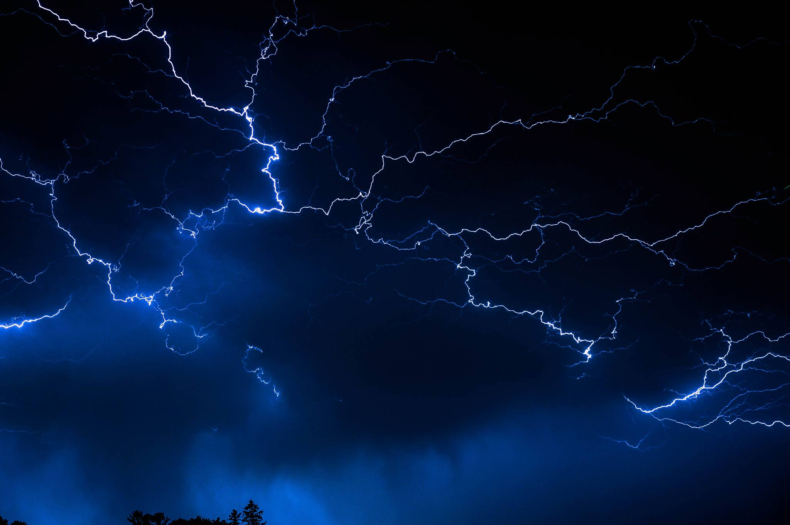

Have you ever felt a rush of adrenaline pulse through your veins while standing in awe to the point of mesmerization while viewing lightning? For me, the answer yes and to this day I've held a keen fascination with its sheer power, compelling me to capture it in still image form. Growing up, I'd often find myself racing down backroads, chasing storms in the hopes of doing just this. As entertaining of a past time this has been, it doesn’t necessarily produce the desired results.  

> My experience photographing lightning has been comparable to trying to catch a fly with chopsticks (if that fly were to randomly appear and then disappear in space). 

For every 50 pictures taken, five might include lightning. As you can imagine, it is no easy task. Funny enough, it was when I was at the most amateur stage of my photography that I managed to capture my best photo to date. 

Having faced the challenges associated with photographing lightning, I've been compelled to find a more efficient solution to said challenges. Luckily, in the past few years, I've expanded my knowledge surrounding computers and the programs that drive them. Thus, I've hatched a plan to achieve the desired result. 

### **tl:dr**
- Lightning is pretty badass
- It's unpredictable and hard to capture in a still image
- I want to use tech to automate the process of capturing lightning 

  

At a high level, my glorified science fair project can be broken down into the *"Why (motives),"* the *"How (tech),"* and the *"What (end result)"*:

### *Why (motives)?*

1. Find a better solution to photographing lightning (other than running around like a chicken with its head cut off).
2. Create a fun side project that will provide me the opportunity to utilize various technologies potentially aiding with my career in tech. 

Now let's move onto the different technologies I plan to utilize and the experience to be gained while working with them. Disclaimer, I haven't fully fleshed out the details so the list below will be subject to change. 

### *How (tech)?*
1. Raspberry Pi 
* A chance to get my hands dirty with automation (triggering and uploading shots), a programming language (Python) and OS (Linux); the latter two of which I'm not yet well versed. 
2. AWS
* AWS will provide infrastructure that's simple to spin up and shouldn't cost a lot (assuming I'm careful). Services subject to change include API Gateway, Lamda's and S3 buckets. 
        
That brings us to the most important part: what the heck will I have to show for my efforts?

### *What (end result)?*
* The ultimate end result will likely include a series of filtered out images (containing lightning strikes) located in an S3 bucket. 

So that's that, let's end on a few closing remarks. The project will be incremental in nature and will be documented in the form of a blog series. Please note, this is my first blog series so bear with me. Each stage of the project will translate to a post in the series. Stay tuned, for my next post will include the process I employ to automatically shoot images from my DSLR utilizing my Rasberry Pi. 

Oh, and every project needs a good name! Let's call it "Catching lightning in the still image form"

