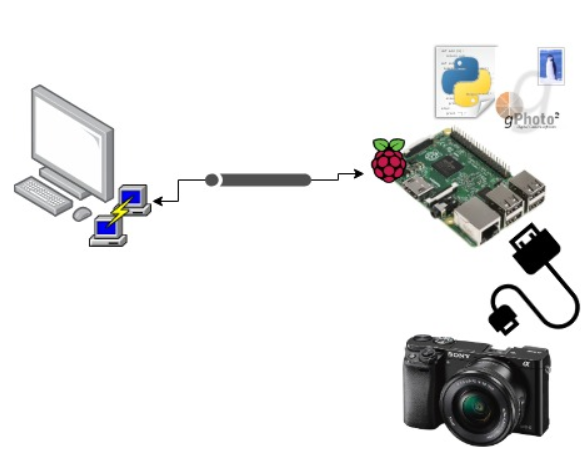

# Taking photos via gPhoto 📸

In my last post I provided a high level overview of the project I am embarking on. With the high level in mind, it's time to get a little more technical and start fleshing out the means in which I will achieve my goals. The first rational step that came to mind was driving my DSLR via my Raspberry PI. Moreover, I want to determine how to utilize Python to create a script that would do this automatically. Below is a concept image of what will be done in this post. 

<div style="text-align:center"></div>

## Goals 💡

1. Utilize a Raspberry PI to trigger shots from my DSLR camera
2. Create a python script to automatically trigger shots

## Required items 🔧

1. **Computer** (optional, you can do it with just the pi)
2. **SSH Client** (ex. Putty) or **Remote Desktop** 
3. **Rasberry Pi** -- I used a Model 3
4. **gPhoto** 
5. **USB cord** (to connect pi ➡ DSLR)
6. **DSLR Camera** 

### Side Note ❕❗
 You will want to check gPhoto's docs to see if your camera is compatible. I used a Sony A6000. 

# Tutorial 📝

## Installing gPhoto 

gPhoto is the library that will enable us to *trigger shots on our DSLR camera*. To start we will want to pull up a terminal on our Raspberry Pi. My approach for ease of use was to SSH into the Pi from my laptop using Putty as my client. You can also remote desktop into your Pi if you'd like more of a UI. Here are some resources for if you'd like to do the same ([SSH instructions](https://www.raspberrypi.org/magpi/ssh-remote-control-raspberry-pi/) & [Windows Remote Desktop](https://www.makeuseof.com/tag/remote-connect-windows-pc-raspberry-pi/))

```shell
sudo apt-get update
sudo apt-get install gPhoto
sudo apt-get install python3-pip
sudo pip3 install sh
```

Now that we have gPhoto installed and ready to go, we will take some photos. First, make sure that your camera is plugged into your raspberry pi (via USB cord) and turned on. We will want to make sure that gPhoto is able to pick up our camera with...

```s
pi@raspberrypi:~ $ gPhoto --auto-detect
Model                          Port
----------------------------------------------------------
Sony Alpha-A6000 (Control)     usb:001,084
```
In my case, I am able to see that my `Sony Alpha-A6000` is seen (change). If your camera hasn't been detected, check [Gphoto's docs](http://gphoto.org/proj/libgPhoto/support.php) to see if your camera is compatible. If it is, the issue might be the usb cord (FYI. I had to buy a new cord).

## gPhoto CLI

With your camera connected, you can take some shots with gPhoto! To take a photo, run: 

```s
pi@raspberrypi:~ $ gPhoto --capture-image-and-download
```

This command will capture and download the image to the current directory in your raspberry pi. Pretty cool, right? Now we will want to move onto creating a Python script that will automatically do this for us. 

## gPhoto Python Script

Taking photos via the CLI is fun and all, but we have to take it a step further if we want to automatically take photos at a given interval. One way of achieving this is by utilizing gPhoto in a Python script. I will not be covering how to create/run a python script on a Rasberry PI; however, if you'd like that information, take a look at this [post] (http://www.circuitbasics.com/how-to-write-and-run-a-python-program-on-the-raspberry-pi/). 

### Importing necessary modules

At the top of your script you will want to import the following modules:

```py
from time import sleep # <-- sleep between shots
from datetime import datetime # <-- timestamp shots
from sh import gphoto2 as gp # <-- trigger shots
import signal # <-- handling async events  
import os # <-- access OS operations (ex. creating directory)
import subprocess # <-- create processes 
```

For organization's sake, we will create a function that creates a folder in which we will place our images that's timestamped with the date.

```py
def createSaveFolder(save_location):
    try:
        print("Creating folder to save images: ", save_location)
        os.makedirs(save_location)
        os.chdir(save_location)
        current_directory = os.getcwd()
        print("Current Directory: ", current_directory)
    except:
        print("failed to create the new directory.")
```

Next,  we  will want to create a function that interfaces with gPhoto2 and takes our images.

```py
def capture_cmd():
    shot_time = datetime.now().strftime("%Y-%m-%d" "%H:%M:%S")
    triggerAndDownloadWithName = [
        "--capture-image-and-download", "--filename", shot_time]
    return triggerAndDownloadWithName
```

This function will trigger a photo and download it with the filename being a timestamp. Lastly, we will want a function that will take a given number of sequential photos.  

```py
def captureImage(num_images, shutter_speed):
    for x in range(0, num_images):
        trigger_cmd = capture_cmd()
        gp(trigger_cmd)
        sleep( shutter_speed + 2 )
```

The rationale behind `sleep( shutter_speed + 2 )` is that you don't want to command the camera to take a photo while it's already taking a photo. Doing so results in issues with gPhoto2. Lastly, at the bottom of the script, you should add:

```py
createSaveFolder(shot_date)
captureImage(20, 20)
```

Now that you have the script created, you can run it and just sit back and relax while your camera magically takes pictures on its own. 


## Closing Remarks

We now have created a means in which to automatically take photos from our DSLR. In the context of the project, we will want to take a series of photos during a lightning storm with this process. Granted, there will be some minor tweaks that come along with this, for example, tweaking shutter speed and the amount of shots taken. The next post will include how we utilize AWS services to process these images and store them.  